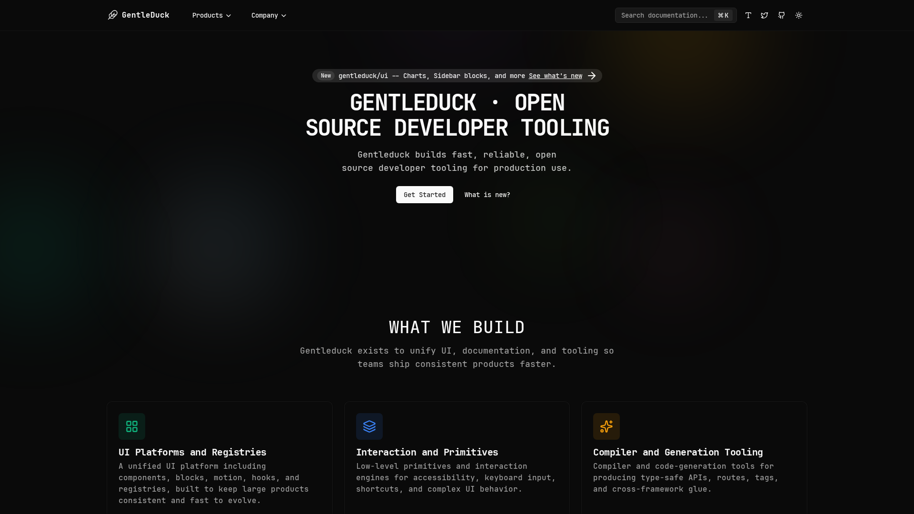

<p align="center">
  
</p>

# gentleduck/www

A Bun-based monorepo for the gentleduck.org website, docs, UI components, and related tooling.

## Documentation
- Website: https://gentleduck.org
- GitHub: https://github.com/gentleeduck/duck-www

## Workspace Matrix

### Apps

| Path | Package | Role | Status |
| --- | --- | --- | --- |
| `apps/www` | `@gentleduck/www` | Public docs site, component playground, ecosystem hub | Active |

### Packages

| Path | Package | Role | Status |
| --- | --- | --- | --- |
| `packages/ui` | `@gentleduck/ui` | Production-ready React UI components built on Gentleduck primitives | Active |

### Tooling Packages

| Path | Package | Role | Status |
| --- | --- | --- | --- |
| `tooling/biome` | `@gentleduck/biome-config` | Shared Biome config | Internal |
| `tooling/github` | `@gentleduck/github` | GitHub/project automation support | Internal |
| `tooling/tailwind` | `@gentleduck/tailwind-config` | Shared Tailwind config | Internal |
| `tooling/tsdown` | `@gentleduck/tsdown-config` | Shared `tsdown` config | Internal |
| `tooling/typescript` | `@gentleduck/typescript-config` | Shared TypeScript config | Internal |
| `tooling/vitest` | `@gentleduck/vitest-config` | Shared Vitest config | Internal |
| `tooling/bash` | `bash` | Shell utilities and misc scripts | Internal |

## Workspace Policy

- Root quality scripts target the active workspace graph only.
- All packages are private and internal to this monorepo.

## Getting Started

> Requires **Node >= 22** and **Bun >= 1.3**.

```bash
git clone https://github.com/gentleeduck/duck-www.git
cd duck-www
bun install
```

## Run the Website
```bash
bun --filter @gentleduck/www dev
```

## Common Workspace Commands
```bash
bun run dev          # run all workspace dev tasks
bun run build        # build all packages/apps
bun run test         # run tests across workspaces
bun run check        # biome checks
bun run check-types  # TypeScript type checks
bun run ci           # non-mutating repo verification (check, workspace lint, types, tests, build)
```

## Contributing
We welcome contributions. Please read [`CONTRIBUTING.md`](./CONTRIBUTING.md) and [`CODE_OF_CONDUCT.md`](./CODE_OF_CONDUCT.md).

## License
MIT. See [`LICENSE`](./LICENSE) for more information.
